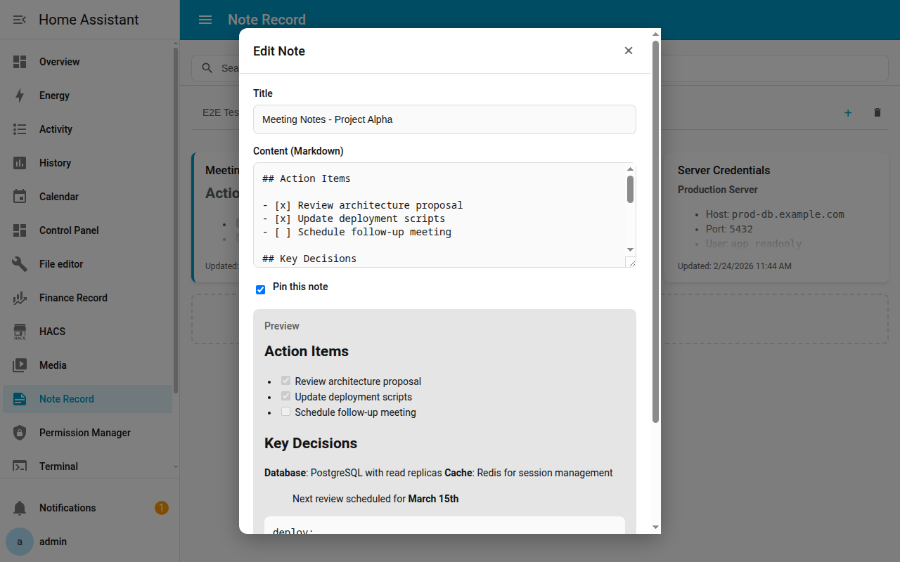

# Ha Note Record

A Home Assistant custom integration for managing categorized notes with Markdown support, pinning, and a custom sidebar panel.

[繁體中文](README_TW.md)

## Features

- **Categorized Notes** - Organize notes into custom categories
- **Markdown Support** - Write notes in Markdown format
- **Pin Notes** - Pin important notes to the top
- **Custom Sidebar Panel** - Dedicated panel with dark/light mode support
- **WebSocket API** - Real-time CRUD operations for the frontend panel

## Screenshots

### Panel Overview

### Note Editing with Markdown Preview

## Installation

### HACS (Manual Repository)

1. Open HACS in Home Assistant
2. Click the three dots menu in the top right corner
3. Select **Custom repositories**
4. Add this repository URL and select **Integration** as the category
5. Click **Download**
6. Restart Home Assistant

### Manual Installation

1. Copy the `custom_components/ha_note_record` folder to your Home Assistant `config/custom_components/` directory
2. Restart Home Assistant

## Configuration

1. Go to **Settings** > **Devices & Services**
2. Click **Add Integration**
3. Search for **Note Record**
4. Follow the setup wizard

After installation, manage notes and categories through:
- **Options flow** - Add/delete categories and notes via the integration's configuration page
- **Sidebar panel** - Use the dedicated panel for a richer note management experience

## Requirements

- Home Assistant **2025.12.0** or later